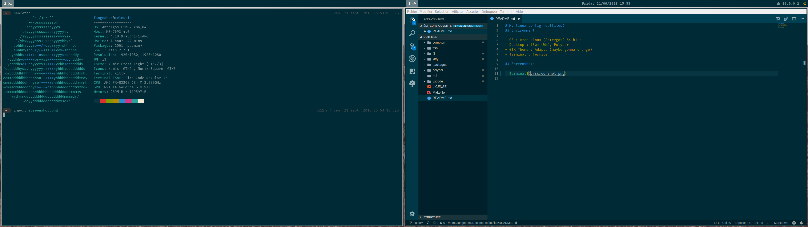

# My linux config (dotfiles)

> Note : this dotfiles is messy : it works but I want to rewrite it to be more maintainable.
> Also, currently, I'm changing a lot and testing differents desktops to see what suit me more. So there will be not update in this README until I'm okay with the desktop I want

## Environment (outdated)

- OS : Arch Linux (Antergos) 64 bits
- Desktop : i3wm (WM), Polybar, Rofi
- Color Scheme : Solarized Dark
- Terminal : Kitty

## Screenshots

